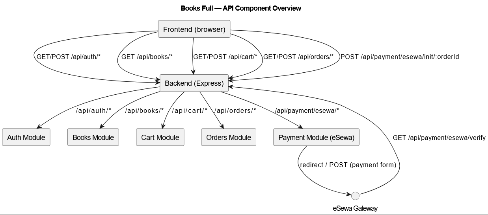
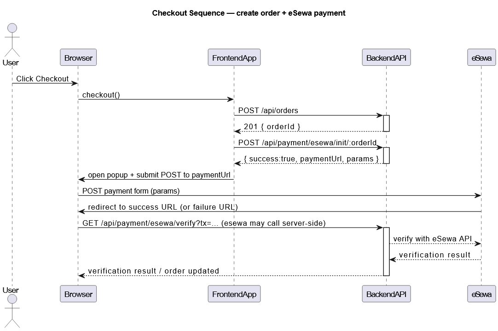

## Books Full — Frontend + Backend

Small e-commerce demo (books) with a Node/Express backend and a lightweight static frontend.

This README documents the runtime setup, the available API routes, examples, and includes PlantUML diagrams (component + checkout sequence) you can render with any PlantUML tool.

**Quick Start**

- Backend: `cd backend` then `npm install` (if needed) and run with `node server.js` (or use your preferred dev command).
- Frontend: `cd frontend` and serve statically (project includes `start` script: `npx http-server -p 3000`).
- Runtime API base: default `http://localhost:5000` (configurable via `API_URL` used by `frontend/scripts/generate-env.js`).

**Environment / Runtime**

- Backend: create `backend/.env` for database and secrets (the repo ignores `.env`).
- Frontend: `frontend/env.js` is generated by `frontend/scripts/generate-env.js` from the `API_URL` environment variable.

Example (PowerShell):

```powershell
$env:API_URL = 'http://localhost:5000'
cd frontend
npm run build
cd ..\backend
node server.js
```

---

**API: Base path**: `/api`

Below are the routes exposed by the backend grouped by module. For each route: HTTP method, path, auth requirement, and controller handler.

**Auth**

- POST `/api/auth/register` — public — `registerUser` (validateRegister)
- POST `/api/auth/login` — public — `loginUser` (validateLogin)
- POST `/api/auth/logout` — public — `logoutUser`
- GET `/api/auth/me` — private — returns current user (middleware: `protectRoute`)

**Books**

- GET `/api/books/search` — public — `searchBooks`
- GET `/api/books/` — public — `getBooks`
- GET `/api/books/:id` — public — `getBookById` (validateObjectId)
- POST `/api/books/` — private — `addBook` (protectRoute, validateBook)
- PUT `/api/books/:id` — private — `updateBook` (protectRoute, validateObjectId)
- DELETE `/api/books/:id` — private — `deleteBook` (protectRoute, validateObjectId)

**Cart** (all routes require auth via `protectRoute`)

- GET `/api/cart/` — private — `getCart`
- POST `/api/cart/items` — private — `addToCart`
- PUT `/api/cart/items/:bookId` — private — `updateCartItem`
- DELETE `/api/cart/items/:bookId` — private — `removeFromCart`
- DELETE `/api/cart/` — private — `clearCart`

**Orders** (private)

- POST `/api/orders/` — private — `createOrder`
- GET `/api/orders/` — private — `getUserOrders`
- GET `/api/orders/:orderId` — private — `getOrderById` (validateObjectId)

**Payment (eSewa integration)**

- POST `/api/payment/esewa/init/:orderId` — private — `initEsewaPayment` (validateObjectId) — initialize payment, returns `paymentUrl` + params
- GET `/api/payment/esewa/verify` — public — `verifyEsewaPayment` — eSewa calls this after successful payment
- GET `/api/payment/esewa/failed` — public — `handleEsewaFailure` — eSewa calls this on failure
- GET `/api/payment/esewa/status/:orderId` — private — `checkEsewaPaymentStatus` (validateObjectId)

---

Usage examples (curl)

- Register:

```bash
curl -X POST 'http://localhost:5000/api/auth/register' \
  -H 'Content-Type: application/json' \
  -d '{"name":"Alice","email":"a@example.com","password":"secret"}'
```

- Login (cookies used by backend, so use `-c`/`-b` with curl for cookies):

```bash
curl -X POST 'http://localhost:5000/api/auth/login' -c cookies.txt \
  -H 'Content-Type: application/json' -d '{"email":"a@example.com","password":"secret"}'
```

- Get books:

```bash
curl 'http://localhost:5000/api/books'
```

- Create order (authenticated):

```bash
curl -X POST 'http://localhost:5000/api/orders' -b cookies.txt
```

Checkout (high-level):

1. Frontend calls `POST /api/orders` to create an order.
2. Frontend calls `POST /api/payment/esewa/init/:orderId` to obtain `paymentUrl` + `params`.
3. Frontend submits a form (POST) to `paymentUrl` in a popup window (esewa page).
4. eSewa redirects/calls `GET /api/payment/esewa/verify` (server verifies and updates order/payment status) or `GET /api/payment/esewa/failed`.

---

1. Component diagram — shows frontend ↔ backend modules and endpoints.

```

```

2. Sequence diagram — checkout flow (frontend -> backend -> eSewa -> backend callback)

```

```
